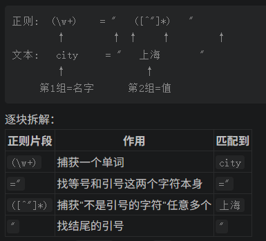
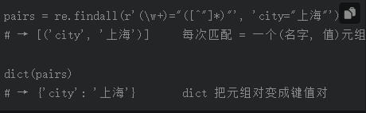

# Day2 studynote
## 旅游助手代码学习
| Python考点 | 在FirstAgentTest.py里的位置 | 问题 |
|---|---|---|
| 函数 | get_weather、get_attraction两个工具函数 | 
| 类（__init__、self） | OpenAICompatibleClient 类 |
| 字典 + 列表 + 循环 | 主循环里的 prompt_history、messages | 循环嵌套具体是怎样一个逻辑？wttr.in返回的数据？API是什么？为什么要设计成列表套列表？ |
| 正则表达式 | 解析模型输出的 re 部分 | 模型不上网，什么是正则？|
| 异常处理 | try/except 块 |
| 看报错 | 你已经实战过一次 |

 脚本整体结构：函数——try/expect——调API——格式化—— return
 API:网站开放给程序调用的"取货窗口"
     wttr.in/Beijing: 网站返回的是可视化页面
     加上 ?format=j1：网站返回给程序看的 JSON 数据（机器易读的格式）
 API:设计成列表套列表，通用规则

 # Day3 studynote
 ## 续Day2
 r"..." 的 r 前缀表示"原始字符串"，让 \w 这样的反斜杠保持原样不被 Python 误处理。先记住加 r 是正则的固定写法即可
 ### 正则学习
 # 正则表达式符号速查表

| 符号 | 描述的长相 | 具体例子 |
| --- | --- | --- |
| 普通文字 | 找它本身 | `Action:` 就是找这几个字本身（A-c-t-i-o-n-冒号-空格） |
| `.` | 任意一个字符（像扑克牌"癞子"，可替任何牌） | `.` 可以匹配 `A`、`9`、空格、`中`、`文` |
| `*` | 前面的内容重复 0 次或任意多次 | 见下 |
| `.*` | 任意长度、任意内容（连起来用最常用） | `Action: (.*)` = 找 `"Action: "` 后面跟的随便什么内容 |
| `\w` | 一个"文字积木"（字母/数字/下划线） | `\w+` = 至少一个积木 = 一个单词 |
| `+` | 前面的内容重复 1 次或更多次 | `get_\w+` = 以 `get_` 开头的单词 |
| `(...)` | 圈住匹配到的部分，之后可取出来 | `(\w+)` 圈住单词，用 `group(1)` 取出 |
| `[^"]` | 不是引号的任意字符 | `[^"]*` = 不含引号的任意内容 |
重点了解：.  *  +  \w  \d（数字）  ( )捕获  [ ]集合  [^ ]排除  \(转义  \s（空白字符）
* Q:r'(\w+)="([^"]*)"' 的名字和值怎么对应,又是如何对应为字典的？*
把正则和文本上下对齐看，对应关系一目了然：

名字和值如何"对应"：因为它们是同一对括号组，一次匹配同时抓到两个：findall 遇到多个捕获组时，返回"元组列表"：

如果文本里有两对（如 city="北京", weather="Sunny"），findall 会扫出两个元组，dict() 一次变成双键字典——这就是脚本第 204 行 kwargs 的来源。

### OpenAICompatibleClient 类，第 113-139 行
**什么是类？这里为什么要用类？**
| 概念 | 手机类比 | 代码里对应 |
| --- | --- | --- |
| 类（class） | iPhone 的设计图纸——描述"一台手机应该有什么"，本身不是手机 | `class OpenAICompatibleClient:` |
| 实例 | 按图纸造出来的、你手里这台真手机 | 第 156 行造出的 `llm` |
| 属性（self.xxx） | 你这台手机的序列号、容量 | `self.model`、`self.client` |
| 方法（def） | 手机的按钮：拍照、打电话 | `generate` 按钮 |
**类把配置+动作打包成一个整体？这是什么意思**
类这个整体是有记忆的（配置），第n次调用时可以重复使用，而不用重新配置

**类中的def是什么？是函数么？为什么要嵌套函数？**
类中的def是方法，和普通函数的区别：第一个参数固定是 self；必须通过实例调用（llm.generate(...)）。
generate相当于把这个流程封装起来了，主循环调用时，只需要给他输入，拿到输出，不用考虑中间的复杂流程。（跟函数差不多）

**__init__初始化为什么要传入model、api_key、base_url这三个零件呢**
| 零件 | 作用 | 类比 |
| --- | --- | --- |
| `api_key` | 身份凭证（你是谁、有没有权限） | SIM 卡 |
| `base_url` | 服务器地址（连到哪家服务） | 运营商网络 |
| `model` | 用哪个模型干活 | 手机型号 |

**模型看到“上一步失败了”具体是如何调整策略的？或者这个问题不重要因为这是我们调用的大模型所做的工作？**
1. 上一步失败 → 主循环把错误文字拼成 Observation: 错误：... → 加进历史列表 prompt_history
2. 下一轮 generate 时，整个历史被当成输入喂给模型——模型读到的上下文里就包含"上次失败了"
3. LLM 的本质是"根据上下文预测下一个词"。上下文变了（多了一条失败记录），它生成的回复自然就变了——可能换个工具、换个问法、或者干脆承认失败